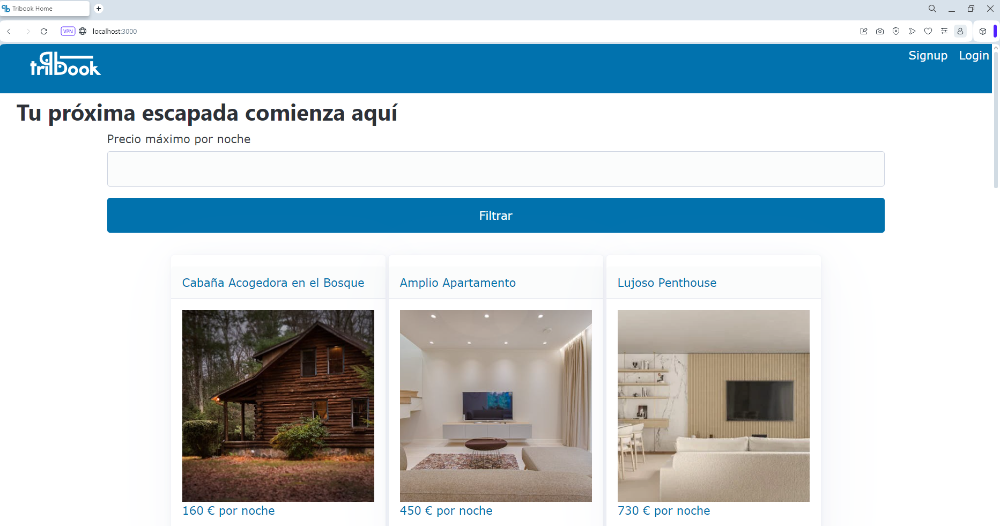

# Tribook
# Tribook - Apartment Booking System

## Overview

**Tribook** is a web application designed for managing and booking apartments. The app offers both public and admin routes, with session-based authentication for admin users. The core functionality includes viewing apartments, searching for listings, making reservations, and for admins, publishing, unpublishing, and editing apartment listings.

**Video Presentation** : https://vimeo.com/1016818894

## Features

- **Public User Routes**:
  - View apartment listings.
  - Search for apartments.
  - Book apartments.
  - View reservation summary.
  
- **Admin Routes**:
  - Add new apartments.
  - Edit apartment details.
  - Publish and unpublish apartment listings.

- **Authentication**:
  - User login and signup.
  - Session-based authentication for secure access to admin functionalities.

## Tech Stack

- **Backend**: Node.js, Express.js
- **Database**: MongoDB with Mongoose ODM
- **Templating Engine**: EJS for server-side rendering
- **Session Management**: Session-based authentication and authorization
- **Tools**: Vanilla Calendar for reservation date management, Nodemon for development

---

## Routes

### Public Routes

These routes are available to all users:

- **GET /**  
  Displays all available apartment listings.

- **GET /search**  
  Allows users to search for apartments.

- **GET /apartment/:idApartment**  
  Displays detailed information about a specific apartment.

- **POST /apartment/new-reservation**  
  Allows users to create a reservation for an apartment.

- **GET /apartment/reservation-summary**  
  Displays a summary of the user's reservation.

### Admin Routes

Admin routes are protected by session authentication. Only authenticated admins can access these functionalities:

- **GET /apartment/new-apartment**  
  Displays a form to create a new apartment listing.

- **POST /apartment/new-apartment**  
  Submits the form to create a new apartment.

- **GET /apartment/:idApartment/edit**  
  Displays a form to edit an existing apartment.

- **POST /apartment/:idApartment/edit**  
  Submits changes to update an apartment's details.

- **POST /apartment/:idApartment/unpublish**  
  Unpublishes an apartment listing, making it unavailable to public users.

- **POST /apartment/:idApartment/publish**  
  Publishes an apartment listing, making it visible to public users.

---

## Authentication Routes

- **GET /login**  
  Displays the login form.

- **POST /login**  
  Authenticates the user and establishes a session.

- **GET /logout**  
  Logs the user out, terminating the session.

- **GET /signup**  
  Displays the signup form for new users.

- **POST /signup**  
  Registers a new user.

---
## Models

This project uses Mongoose to define three main models for managing the apartment booking system:

### 1. Apartment Model

The **Apartment** model represents the details of each apartment available for booking. It includes the following fields:

- `title`: The title of the apartment (String, required).
- `description`: A detailed description of the apartment (String).
- `price`: The price per night (Number, required).
- `size`: The size of the apartment in square meters (Number, required).
- `rooms`: The number of rooms (Number, required).
- `bathrooms`: The number of bathrooms (Number, required).
- `guests`: Maximum number of guests (Number, required).
- `mainPhoto`: URL of the main photo (String, required).
- `services`: An array of services provided (Array of objects).

### 2. Reservation Model

The **Reservation** model tracks reservations made by users. It includes:

- `email`: The email of the user making the reservation (String, required).
- `apartment`: A reference to the associated apartment (ObjectId, required).
- `startDate`: The start date of the reservation (Date, required).
- `endDate`: The end date of the reservation (Date, required).

### 3. User Model

The **User** model handles user authentication and authorization. It includes:

- `email`: The user's email address (String, required, unique).
- `password`: The hashed password (String, required).
- `isAdmin`: A boolean indicating if the user has admin privileges (Boolean, default: false).

Each model uses Mongoose's schema validation to enforce data integrity and simplify database interactions.

---

## Setup and Installation

To set up the application locally, follow these steps:

### Prerequisites

Ensure that you have the following installed:

- [Node.js](https://nodejs.org/) (version 14.x or higher)
- [MongoDB](https://www.mongodb.com/try/download/community) (Ensure MongoDB is running locally or use a cloud service like MongoDB Atlas)
- [npm](https://www.npmjs.com/) (comes with Node.js)

### Installation Steps

1. **Clone the Repository**
2. **Install Dependencies**
3. **Setup Environment Variables**
4. **Run de the App**
